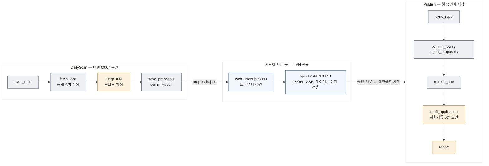

# job-scouter

채용 공고 무인 탐색(수집 → 루브릭 채점)을 Temporal durable workflow 위의 LLM
판정 파이프라인으로 올린 것. 사람이 끼는 지점(등재 승인·거부, 평판 조사)은
LAN 웹앱과 대화형 세션으로 모델링한다.



회색 = `jobscout-io` 큐(자격증명 없음) · 노랑 = `jobscout-llm` 큐(`claude -p`) ·
파랑 = 화면(`web`은 브라우저만, `api`는 컨테이너 안에서만 열린다).

- `judge`는 공고당 activity 1개. JSON 스키마를 강제하고 usage를 기록한다.
  캐시키는 `(공고id, 루브릭버전, 사실베이스 해시)`, 예산을 넘기면 미점수로 강등한다.
- 추천도·통근·순위·마감·`candidates.json` 검증은 `jobscouter/candidates.py` 한 곳에서만 계산한다.
- 이력서 쪽 워크플로(`ResumeSync`·`ApplyResume`·`ResumeChat`·`EndChat`·`RevertFile`·`Draft`)는
  아래 라우트 표 참조.

승인·거부는 `web`(Next.js, :8090)이 `api`(:8091)로 `proposals.json`을 받아 보여주고
버튼으로 `Publish`를 시작한다 — `api`는 데이터 repo를 `:ro`로만 보고, 파일을 직접
고치는 경로는 없다.

데이터 repo에는 md·json과 `settings.json`만 둔다 — 코드도 HTML도 이 저장소에 있다.

큐 4개는 자격증명 격리 경계다. judge·report·초안·이력서 채팅은 Claude Code
headless(`claude -p`, 구독 인증 — 로그인된 CLI 또는 `CLAUDE_CODE_OAUTH_TOKEN`)로 돌고,
이 실행 경계는 llm 워커의 `judge.py`에만 있다 — io·workflow·api 모듈은 judge를
import하지 않는다(테스트로 강제). API 키 불필요. 호출당 지출 상한은
`JudgeInput.max_usd`(`ScanParams.max_usd`, `--budget`).

`jobscout-llm`에는 큐 레벨 레이트리밋(0.5/s)이 걸려 있다. 이력서 채팅은 사람이 화면
앞에서 기다리는 대화라 판정 뒤에 줄 서면 안 되므로 `jobscout-chat` 큐를 따로 쓴다 —
같은 llm 워커 프로세스가 둘 다 돌리고, 채팅 큐에만 리밋이 없다.

## 설정

`.env.example`을 `.env`로 복사해 채운다. 개인 자료는 이 저장소 밖(데이터 repo)에 둔다:

| 항목 | env | 내용 |
|---|---|---|
| jobfeed | `JOBSCOUTER_JOBFEED` | `candidates.json`·`jobs.jsonl`·`proposals.json`·`기업평판.md`·`reports/*.md` |
| 수집 설정 | (jobfeed 상위) | `settings.json` — 수집 키워드와 통근 밴드(`{"keywords": [...], "zones": [[밴드, "라벨", "주소패턴"], ...]}`) |
| 사실베이스 | `JOBSCOUTER_FACTBASE` | 본인 확인 완료 경력 사실 — judge의 감점 근거 |
| 루브릭 | `JOBSCOUTER_PROMPTS` | `rubric_v1.md` — `prompts/rubric_v1.example.md`를 채워서 |

서버 설치: `deploy/SERVER_SETUP.md`. 설계·계획 문서: `docs/specs/` · `docs/plans/`.

## 운영

```bash
uv run python -m jobscouter.worker io    # 터미널 1 — workflow+io (자격증명 없음)
uv run python -m jobscouter.worker llm   # 터미널 2 — judge·report (claude -p)

uv run python -m jobscouter.worker scan [--budget 2000000]   # DailyScan 시작(수동)
uv run python -m jobscouter.worker publish id1 id2 ...       # Publish 시작 — 등재 승인
uv run python -m jobscouter.worker reject <id> "<사유>"      # Publish 시작 — 거부만
uv run python -m jobscouter.worker status                    # 실행 중 DailyScan/Publish 조회
uv run python -m jobscouter.worker resume-sync             # 주 1회 이력서 갱신 제안(수동 시작)
uv run python -m jobscouter.worker apply-resume <id> ...    # 제안 반영
uv run python -m jobscouter.worker schedule                  # 일 1회 자동 시작 등록(매일 09:07 KST)
```

승인·거부는 보통 웹앱에서 한다. 로컬 개발은 API와 화면을 따로 띄운다:

```bash
uv run uvicorn jobscouter.api:app --port 8091          # 터미널 3 — JSON API
cd web && API_URL=http://localhost:8091 npm run dev    # 터미널 4 — 화면 :3000 (LAN 전용, 인증 없음)
```

서버에서는 compose가 둘을 컨테이너로 띄우고 `web`만 :8090으로 연다(`deploy/compose.yaml`).
`web`의 `/api/*` 라우트 핸들러가 `api`로 그대로 넘긴다.

| 경로 | 내용 |
|---|---|
| `/` | `proposals.json` 대시보드(점수·사유·인용) + 승인/거부 체크 → `Publish` 시작. 평판 미조사 회사·최근 실행 상태 |
| `/candidates` | 후보 목록 — 필터(평판·태그·적합도·마감·통근)·정렬은 브라우저에서, 추천도·순위는 서버 값. 행마다 「지원서류 n종 →」/「초안 만들기 →」 |
| `/reports`, `/reports/{name}` | 사이클 보고서 목록·렌더 |
| `/resume/proposals` | 이력서 갱신 제안 승인 → ApplyResume |
| `/resume` | 이력서 정본 `이력서.md` 한 문서 렌더. 「대화로 고치기」·「이력」 링크, 진행 중 대화 목록 |
| `/resume/chat`, `/resume/chat/{sid}` | 대화로 이력서 수정. 한 턴 = `ResumeChat` 워크플로 1회. 수정은 세션 버퍼에만 쌓이고 `저장`을 눌러야 파일 반영 + 커밋 1개(`EndChat`) |
| `/resume/history` | 문서별 커밋 목록·diff. 「되돌리기」는 과거 내용을 **새 커밋으로** 올린다(`RevertFile`) — 히스토리를 지우지 않으므로 되돌린 것도 되돌릴 수 있다 |
| `/applications` | 폴더 ↔ 등재 공고를 **공고 id로 조인**한 목록(추천도·마감·문서 5종 표시) + 못 이은 폴더 |
| `/applications/job/{공고id}` | 공고 한 건의 지원 화면 — 공고 요약 헤더(추천도·적합도·마감·통근·평판) + 문서 탭. 초안 (재)생성 → `Draft` |
| `/applications/{폴더}` | 공고에 연결되지 않은 폴더의 문서만. 연결되면 `/applications/job/{id}`로 리다이렉트 |
| `/docs`, `/docs/{path}` | `references/` 문서 렌더(하위 디렉토리 포함) |

워커가 꺼져 있어도 워크플로는 서버에서 대기하고, 워커를 켜면 이어진다.
판정 캐시는 `data/judgments.jsonl` — 루브릭을 올리면 `rubric_v2.md` 추가 후
`judge.RUBRIC_VERSION` 변경, 전 건이 자동 재판정 대상이 된다.

서버 컨테이너 운영(io·llm·api·web 상시 가동): `deploy/SERVER_SETUP.md`.

## RAG (Phase 3)

기존 ES에 `jobscout_facts`(사실베이스) · `jobscout_precedents`(판정 판례) ·
`jobscout_reputation`(평판 캐시) 인덱스를 만든다. bge-m3 + BM25/kNN 클라이언트
RRF, 리랭커 없음, k=20.

```bash
uv run python scripts/index_es.py          # 재색인 (판례·평판·사실베이스 갱신 시)
uv run python scripts/eval_judge.py [--rag] # 수동 판정 대조 (일치율·MAE)
```
